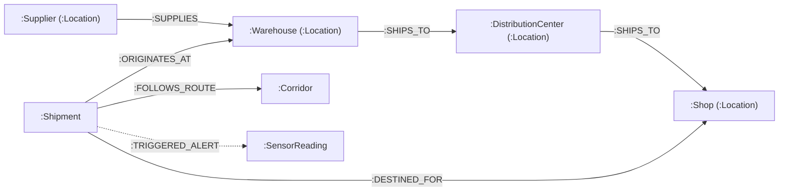

# MeetMux Logistics: Supply Chain Shipment Delay Risk & Route Planning System
## Comprehensive System Architecture, Data Model, API, and Operations Documentation

---

## 1. Executive Summary & Problem Statement

Supply chain operations teams frequently face unexpected road transit disruptions caused by severe weather, regional traffic congestion, infrastructure roadworks, driver fatigue, and cross-docking bottlenecks. Traditional transport management systems (TMS) either offer rigid static route estimates or operate as black boxes that fail to explain *why* a particular corridor is at risk of delay.

**MeetMux Logistics** is an enterprise-grade operations platform designed to:
1. **Track active consignments** and topological facility dependencies across multi-echelon supply networks using a native graph database (**Neo4j**).
2. **Dynamically plan and compare alternative road routes** utilizing the Open Source Routing Machine (**OSRM**) and topological heuristics.
3. **Assess shipment delay risk with transparent contributing factors** using an **XGBoost classification model** or calibrated rule engine, clearly distinguishing machine learning inference from fallback estimates.
4. **Empower dispatchers with interactive simulation tools**:
   - **Live Transit Simulation & Telemetry**: Animated vehicle transit playback along route geometries with speed controls and live checkpoint announcements.
   - **"What-If" Scenario Risk Lab**: Real-time operational parameter tuning (weather, traffic, continuous driver shift hours, roadworks, cold-chain perishability) to project delay deltas and financial cost penalties.
   - **Alternative Route Comparison Matrix**: Side-by-side evaluation of route alternatives across duration, distance, risk probability, fuel consumption, and carbon footprint.

---

## 2. System Architecture & Technology Stack

```
┌─────────────────────────────────────────────────────────────────────────────┐
│                    Frontend Client (React 19 + TypeScript + Vite)           │
│  Shipment Filter │ Multi-Tile Map │ Transit Sim │ What-If Lab │ Route Matrix│
└──────────────────────────────────────┬──────────────────────────────────────┘
                                       │ REST / JSON (Reverse Proxy: Nginx / Vite)
┌──────────────────────────────────────▼──────────────────────────────────────┐
│                    Backend Application Service (FastAPI)                    │
│  ┌─────────────────┐ ┌─────────────────┐ ┌───────────────┐ ┌─────────────┐  │
│  │  Graph Service  │ │  Route Service  │ │Feature Builder│ │ Prediction  │  │
│  │ (Async Neo4j)   │ │  (OSRM / Mock)  │ │ (Engineering) │ │ (XGBoost ML)│  │
│  └────────┬────────┘ └────────┬────────┘ └───────┬───────┘ └──────┬──────┘  │
└───────────┼───────────────────┼──────────────────┼────────────────┼─────────┘
            │                   │                  │                │
     ┌──────▼─────┐      ┌──────▼─────┐     ┌──────▼─────┐   ┌──────▼──────┐
     │   Neo4j    │      │    OSRM    │     │  CSV / DB  │   │   XGBoost   │
     │  Graph DB  │      │   Router   │     │ Historical │   │   Artifact  │
     │  (Port     │      │ (Port      │     │ Corridors  │   │  (.joblib)  │
     │   7687)    │      │  5000/Web) │     │            │   │             │
     └────────────┘      └────────────┘     └────────────┘   └─────────────┘
```

### Technology Matrix

| Layer | Technology | Version | Purpose |
|---|---|---|---|
| **Frontend Framework** | React + TypeScript | React 19, TS 6 | Component state, modular UI rendering |
| **Build Tooling** | Vite | 8.3+ | Fast HMR dev server & optimized static bundle |
| **Mapping Engine** | Leaflet + Custom Canvas | 1.9.4 | Route polylines, pulsing markers, multi-tile layers |
| **Backend Framework** | FastAPI (ASGI) | 0.104+ | Async REST API, OpenAPI docs, dependency injection |
| **Server Runtime** | Python (Docker 3.12 / Host 3.11+) | Python 3.11+ | Python backend execution |
| **Server Engine** | Uvicorn | 0.24+ | Lightning-fast ASGI production server |
| **Validation & Schema** | Pydantic v2 | 2.5+ | Strict data schemas, serialization, and typing |
| **Primary Graph Store**| Neo4j Community / Aura | 5.15+ | Multi-echelon graph network topology & query engine |
| **Routing Engine** | OSRM (Open Source Routing Machine)| HTTP API | Realistic road distance, duration & GeoJSON geometry |
| **Machine Learning** | XGBoost + scikit-learn | 2.0+ / 1.3+ | Binary classification of delay risk |
| **Containerization** | Docker & Docker Compose | Compose v2 | Isolated multi-service production stack |

---

## 3. Graph Data Model & Neo4j Schema

All supply chain entities, facilities, active shipments, and topological dependencies are modeled in **Neo4j**.



### 3.1 Node Labels & Schema

1. **`:Location`**: Base label for all physical nodes.
   - Properties: `id` (string, unique), `name` (string), `type` (enum), `lat` (float), `lon` (float), `address` (string), `is_demo_data` (boolean).
   - Specialized subtypes:
     - `:Supplier`: Upstream component or raw goods manufacturer (`capabilities`, `reliability_score`).
     - `:Warehouse`: Storage and regional fulfillment depot (`capacity_sqft`, `utilization_pct`).
     - `:DistributionCenter`: Last-mile sorting/cross-dock facility (`throughput_units_day`).
     - `:Shop`: Commercial retail destination or delivery endpoint (`store_format`).
     - `:Port`: Maritime or airport intermodal hub (`customs_clearance_avg_hrs`).
2. **`:Shipment`**: Physical transport order.
   - Properties: `id` (string, unique), `status` (`planned`, `in_transit`, `delivered`, `delayed`, `cancelled`), `cargo_type` (string), `weight_kg` (float), `planned_delivery` (ISO 8601 timestamp), `actual_delivery` (optional ISO 8601 timestamp), `is_demo_data` (boolean).
3. **`:SensorReading`**: Telemetry log from transit IoT trackers.
   - Properties: `id` (string), `sensor_type` (`temperature`, `vibration`, `gps`), `reading_value` (float), `threshold` (float), `timestamp` (ISO timestamp), `is_breached` (boolean).

### 3.2 Graph Relationships

- `(:Supplier)-[:SUPPLIES {lead_time_days: int, frequency: string}]->(:Warehouse)`
- `(:Warehouse)-[:SHIPS_TO {corridor_distance_km: float, avg_transit_hours: float}]->(:DistributionCenter | :Shop)`
- `(:Shipment)-[:ORIGINATES_AT {dispatched_at: datetime}]->(:Location)`
- `(:Shipment)-[:DESTINED_FOR {eta_target: datetime}]->(:Location)`
- `(:Shipment)-[:FOLLOWS_ROUTE {distance_km: float, toll_count: int}]->(:Corridor)`

### 3.3 Database Constraints & Indexes

```cypher
// Unique identifiers
CREATE CONSTRAINT location_id_unique IF NOT EXISTS FOR (l:Location) REQUIRE l.id IS UNIQUE;
CREATE CONSTRAINT shipment_id_unique IF NOT EXISTS FOR (s:Shipment) REQUIRE s.id IS UNIQUE;

// Performance query indexes
CREATE INDEX location_type_idx IF NOT EXISTS FOR (l:Location) ON (l.type);
CREATE INDEX shipment_status_idx IF NOT EXISTS FOR (s:Shipment) ON (s.status);
CREATE INDEX shipment_planned_delivery_idx IF NOT EXISTS FOR (s:Shipment) ON (s.planned_delivery);
```

---

## 4. Delay-Risk Machine Learning & Feature Engineering

### 4.1 Target Definition & Decision Horizon
- **Target**: Binary classification indicating whether a consignment will suffer a significant delay (`delay_minutes > 30`).
- **Horizon**: Predicted at route dispatch time prior to vehicle departure.
- **Integrity Guarantee**: The platform strictly marks predictions as:
  - `model_prediction`: Real inference produced by a loaded, versioned `.joblib` model.
  - `fallback_estimate`: Heuristic estimate generated from corridor distance and historical baseline rates, clearly labelled with warning badges.
  - `unavailable`: External dependency error where no estimate can be responsibly computed.

### 4.2 Feature Pipeline (`FeatureBuilder`)
Features ingested into model inference:
1. `distance_km`: Planned highway travel distance.
2. `duration_minutes`: Estimated standard transit duration.
3. `avg_speed_kmh`: Planned travel velocity (`distance_km / (duration_minutes / 60)`).
4. `weight_kg`: Gross payload weight.
5. `hour_of_day`: Scheduled departure hour (capturing peak rush periods).
6. `day_of_week`: Day of dispatch (capturing weekend / weekday freight bottlenecks).
7. `cargo_type_encoded`: One-hot encoded category (e.g., Electronics, Perishables, Hazardous, General).
8. `network_node_degree`: Topological connectivity of origin and destination facilities in Neo4j.

---

## 5. REST API Reference

All REST endpoints are prefixed under `/api/v1`.

### 5.1 System Health
```http
GET /api/v1/health
```
**Response (200 OK):**
```json
{
  "status": "healthy",
  "version": "0.1.0",
  "environment": "development",
  "dependencies": [
    {
      "name": "neo4j",
      "status": "healthy",
      "latency_ms": 3.4,
      "message": "Connected to Neo4j graph engine"
    },
    {
      "name": "route_provider",
      "status": "healthy",
      "latency_ms": 1.2,
      "message": "Provider: mock"
    },
    {
      "name": "prediction_service",
      "status": "healthy",
      "latency_ms": 0.5,
      "message": "Fallback rule engine active (model artifact not loaded)"
    }
  ]
}
```

---

### 5.2 List Shipments
```http
GET /api/v1/shipments?page=1&page_size=20&status=in_transit
```
**Query Parameters:**
- `page` (optional integer, default `1`): Page number.
- `page_size` (optional integer, default `20`, max `100`): Results per page.
- `status` (optional string): Filter by status (`planned`, `in_transit`, `delivered`, `delayed`, `cancelled`).

**Response (200 OK):**
```json
{
  "data": [
    {
      "id": "SHP-001",
      "origin_name": "Bhiwandi Central Hub",
      "destination_name": "Gurugram Delivery Center",
      "status": "in_transit",
      "planned_delivery": "2026-09-25T14:30:00Z",
      "cargo_type": "electronics",
      "is_demo_data": true
    }
  ],
  "meta": {
    "page": 1,
    "page_size": 20,
    "total_items": 8,
    "total_pages": 1
  }
}
```

---

### 5.3 Shipment Details
```http
GET /api/v1/shipments/{shipment_id}
```
**Response (200 OK):**
```json
{
  "id": "SHP-001",
  "origin": {
    "id": "LOC-BHW-01",
    "name": "Bhiwandi Central Hub",
    "type": "warehouse",
    "coordinates": { "lat": 19.2812, "lon": 73.0489 },
    "address": "Bhiwandi Logistics Park, Maharashtra",
    "is_demo_data": true
  },
  "destination": {
    "id": "LOC-GGN-01",
    "name": "Gurugram Delivery Center",
    "type": "distribution_center",
    "coordinates": { "lat": 28.4595, "lon": 77.0266 },
    "address": "Sector 18, Gurugram, Haryana",
    "is_demo_data": true
  },
  "status": "in_transit",
  "planned_delivery": "2026-09-25T14:30:00Z",
  "cargo_type": "electronics",
  "weight_kg": 4200.0,
  "is_demo_data": true
}
```

---

### 5.4 Shipment Network Topology
```http
GET /api/v1/shipments/{shipment_id}/network
```
Returns connected upstream suppliers, regional intermediate warehouses, and destination facilities linked in Neo4j.

**Response (200 OK):**
```json
{
  "shipment_id": "SHP-001",
  "locations": [
    {
      "id": "LOC-BHW-01",
      "name": "Bhiwandi Central Hub",
      "type": "warehouse",
      "coordinates": { "lat": 19.2812, "lon": 73.0489 },
      "is_demo_data": true
    }
  ],
  "links": [
    {
      "source": { "id": "LOC-SUP-01", "name": "Pune Components Ltd", "type": "supplier" },
      "target": { "id": "LOC-BHW-01", "name": "Bhiwandi Central Hub", "type": "warehouse" },
      "relationship": "supplies",
      "active": true
    }
  ],
  "is_demo_data": true
}
```

---

### 5.5 Plan Routes & Predict Delay Risk
```http
POST /api/v1/routes/plan
Content-Type: application/json

{
  "origin": { "lat": 19.0760, "lon": 72.8777 },
  "destination": { "lat": 28.6139, "lon": 77.2090 },
  "shipment_id": "SHP-001"
}
```

**Response (200 OK):**
```json
{
  "routes": [
    {
      "id": "route_1_national_corridor",
      "distance_km": 1412.5,
      "duration_minutes": 1380.0,
      "geometry": {
        "type": "LineString",
        "coordinates": [[72.8777, 19.0760], [75.8577, 22.7196], [77.2090, 28.6139]]
      },
      "provider": "mock",
      "risk": {
        "probability": 0.38,
        "risk_band": "medium",
        "prediction_status": "fallback_estimate",
        "model_version": "0.1.0",
        "factors": [
          {
            "name": "Route Distance",
            "description": "Route distance of 1412 km is above average",
            "impact": "increases_risk",
            "value": "1412 km"
          },
          {
            "name": "Cargo Sensitivity",
            "description": "Standard freight class with low risk",
            "impact": "decreases_risk",
            "value": "Electronics"
          }
        ],
        "message": "Fallback estimate based on distance and historical corridor averages."
      }
    }
  ],
  "origin": { "lat": 19.0760, "lon": 72.8777 },
  "destination": { "lat": 28.6139, "lon": 77.2090 },
  "shipment_id": "SHP-001",
  "is_demo_data": true
}
```

---

## 6. Interactive Frontend Dashboard Features

The user interface is built on a dark operations dashboard design system with rich interactivity:

### 6.1 Live Route Transit Simulation Engine (`RouteSimulation.tsx`)
- **Animated Vehicle Marker**: A delivery truck (`🚚`) moves along the route's GeoJSON polyline with bearing angle interpolation so it faces forward along the road curve.
- **Playback Controls**: Play, Pause, Step Back (`-5%`), Step Forward (`+5%`), Reset, and Speed toggles (`1x`, `2x`, `5x`, `10x`).
- **Live Telemetry HUD**:
  - Simulated velocity (km/h) with natural variance.
  - Traveled distance vs total distance.
  - Real-time ETA countdown.
  - Active waypoint phase (e.g., *Departing Origin* ➔ *Highway Transit Corridor* ➔ *Toll Crossing* ➔ *Destination Approach*).
  - High-risk bottleneck warning popups along congested highway segments.
- **Camera Tracking**: Toggle "Follow Vehicle" to automatically center the map on the truck.

### 6.2 "What-If" Scenario Delay Risk Lab (`RiskSimulator.tsx`)
Logistics dispatchers can test operational variables in real-time:
- **Weather Severity**: Clear (`0%`), Rain (`+12%`), Fog (`+18%`), Storm (`+28%`).
- **Traffic Congestion**: Fluid, Moderate (`+6%`), Heavy (`+16%`), Gridlock (`+26%`).
- **Driver Shift Hours**: 1 to 14 continuous hours; triggers driver fatigue alerts if over 8 hours.
- **Infrastructure**: Road work zone toggle (`+11%` risk, speed restricted to 40 km/h).
- **Cold-Chain Safety**: Temperature-sensitive cargo toggle; triggers spoilage warnings and calculated penalty fines.
- **Vehicle Maintenance**: Optimal vs Diagnostic Warning (`+14%`).
- **Real-Time Outputs**: Recalculates delay probability, projected delay minutes, cost penalty in dollars ($), and dynamic AI dispatch recommendations.

### 6.3 Side-by-Side Alternative Route Comparison Matrix (`RouteComparison.tsx`)
- Directly compares candidate routes side-by-side.
- Smart algorithmic classification tags:
  - 🛡️ **Safest**: Lowest delay risk probability.
  - ⚡ **Fastest**: Minimum transit duration.
  - 🛣️ **Shortest**: Lowest total distance.
- Environmental and resource analytics:
  - Estimated fuel consumption in liters (~0.28 L/km).
  - Estimated carbon footprint in kg CO₂ (~0.72 kg/km).
- 1-click route activation that highlights the polyline and fits the map camera.

### 6.4 Multi-Tile Interactive Map (`MapView.tsx`)
- **Layer Switcher**: Toggle between **Dark Matter** (`🌙 Dark`), **OpenStreetMap** (`🗺️ Street`), and **Esri World Imagery** (`🛰️ Satellite`).
- **Direct Map Clicking**: In custom route mode, users can click anywhere on the map to set Origin (🟢) and Destination (🔴) without typing raw coordinates.
- **Pulsing Radar Pins**: CSS keyframe pulse rings highlighting facility pins.
- **Layer Toggles**: Show/hide supply-chain nodes, routes, or vehicle markers.

### 6.5 Interactive Shipment Management & HUD (`ShipmentSelector.tsx`, `ShipmentInfo.tsx`)
- **Instant Search**: Real-time filtering by tracking ID, origin, destination, or cargo category.
- **Status Filter Chips**: Instant filter for `All`, `In Transit`, `Delayed`, `Planned`.
- **Corridor Presets**: 1-click test corridors (Mumbai ➔ Delhi, Bengaluru ➔ Chennai, Kolkata ➔ Patna, Pune ➔ Ahmedabad).
- **Lifecycle Milestone Tracker**: 4-stage visual tracker: `Created` ➔ `Dispatched` ➔ `In Transit` ➔ `Delivered`.
- **Manifest Export**: 1-click JSON manifest download for transport dispatchers.
- **Notification Toasts**: Non-intrusive action feedback toasts.

---

## 7. Quickstart & Setup Guide

### 7.1 Prerequisites
- **Docker & Docker Compose** (Recommended): Docker Desktop installed and running.
- **Node.js**: v18+ (tested on Node v20 & v22).
- **Python** (for local backend development): Python 3.11+.

---

### 7.2 Method A: Full Docker Compose (Recommended)

1. **Clone the repository and enter the directory**:
   ```bash
   git clone https://github.com/rajubhagat100/heckathon-meetmux.git
   cd heckathon-meetmux
   ```

2. **Configure Environment Variables**:
   Copy `.env.example` to `.env`:
   ```bash
   # Windows PowerShell
   Copy-Item .env.example .env

   # Linux / macOS
   cp .env.example .env
   ```

3. **Start the Entire Stack**:
   ```bash
   docker compose up -d --build
   ```

4. **Verify Container Health**:
   ```bash
   docker compose ps
   ```
   - Neo4j: `http://localhost:7474` (Bolt: `bolt://localhost:7687`)
   - Backend API: `http://localhost:8000` (Docs: `http://localhost:8000/docs`)
   - Frontend Dashboard: `http://localhost:5173`

---

### 7.3 Method B: Local Hybrid Development (Fastest for UI Dev)

1. **Start Neo4j via Docker**:
   ```bash
   docker compose up -d neo4j
   ```

2. **Load Seed Data into Neo4j**:
   ```bash
   # Using cypher-shell inside the container:
   Get-Content backend/data/neo4j/schema.cypher | docker exec -i meetmux-neo4j cypher-shell -u neo4j -p password123
   Get-Content backend/data/neo4j/seed.cypher | docker exec -i meetmux-neo4j cypher-shell -u neo4j -p password123
   ```

3. **Run the Backend**:
   ```bash
   cd backend
   python -m venv .venv
   # Windows:
   .venv\Scripts\activate
   # Linux/macOS:
   # source .venv/bin/activate

   pip install -r requirements.txt
   uvicorn app.main:app --reload --port 8000
   ```

4. **Run the Frontend**:
   ```bash
   cd frontend
   npm install
   npm run dev
   ```

5. **Open Browser**:
   Navigate to **`http://localhost:5173`**.

---

## 8. Testing & Quality Assurance

### 8.1 Frontend Build & Unit Tests
```bash
cd frontend

# Verify TypeScript compilation and production bundle
npm run build

# Run unit tests (Vitest + JSDOM)
npm test

# Run code style and lint check (Oxlint)
npm run lint
```

### 8.2 Backend Test Suite
```bash
cd backend

# Run all pytest test suites
pytest -v

# Run code style check
ruff check .
```

---

## 9. Environment Configuration Dictionary (`.env`)

| Variable | Default Value | Description |
|---|---|---|
| `APP_ENV` | `development` | Runtime environment (`development`, `staging`, `production`) |
| `APP_DEBUG` | `true` | Enables Swagger UI documentation at `/docs` |
| `APP_SECRET_KEY` | `dev-secret-key-12345` | Internal signing key |
| `BACKEND_HOST` | `0.0.0.0` | Network binding host |
| `BACKEND_PORT` | `8000` | Port for FastAPI HTTP server |
| `BACKEND_CORS_ORIGINS` | `["http://localhost:5173"]` | Authorized CORS origins |
| `NEO4J_URI` | `bolt://localhost:7687` | Neo4j Bolt protocol URI |
| `NEO4J_USER` | `neo4j` | Neo4j database username |
| `NEO4J_PASSWORD` | `password123` | Neo4j database password |
| `NEO4J_DATABASE` | `neo4j` | Active database instance |
| `ROUTE_PROVIDER` | `mock` | Routing engine: `osrm_self_hosted`, `osrm_public_demo`, `mock` |
| `OSRM_BASE_URL` | `http://localhost:5000` | OSRM server endpoint (if using self-hosted OSRM) |
| `ROUTE_TIMEOUT_SECONDS` | `10` | Timeout for route queries |
| `MAP_TILE_PROVIDER` | `osm` | Default map tile scheme (`osm`, `mapbox`, `custom`) |
| `MODEL_ARTIFACT_PATH` | *(empty)* | Relative path to trained `.joblib` model artifact |
| `MODEL_VERSION` | `0.1.0` | Identifier of active ML model artifact |
| `AUTH_ENABLED` | `false` | Enable/disable JWT/OIDC authentication middleware |
| `RATE_LIMIT_PER_MINUTE`| `60` | API rate limit per client IP |
| `VITE_API_BASE_URL` | `http://localhost:8000` | Backend API base URL for frontend build |

---

## 10. Repository Directory Structure

```
heckathon-meetmux/
├── .env.example                     # Environment template configuration
├── .gitignore                       # Git ignore rules
├── docker-compose.yml               # Multi-service container orchestration
├── README.md                        # Project introductory overview
├── PROJECT_DOCUMENTATION.md         # Master comprehensive documentation
├── DEPLOYMENT.md                    # Production deployment guide
├── docs/                            # In-depth architectural references
│   ├── architecture.md              # Component boundaries & ML integrity
│   ├── data_model.md                # Full Neo4j schema & Cypher patterns
│   ├── deployment.md                # Cloud deployment guides
│   └── operations.md                # Maintenance runbooks
├── backend/
│   ├── Dockerfile                   # Python 3.12 multi-stage Docker build
│   ├── requirements.txt             # Python dependencies
│   ├── app/
│   │   ├── main.py                  # FastAPI application entry & lifecycle
│   │   ├── config.py                # Environment configuration settings
│   │   ├── dependencies.py          # Dependency injection container
│   │   ├── middleware.py            # CORS, request logging, error handling
│   │   ├── seed.py                  # Automated database seed script
│   │   ├── models/
│   │   │   ├── domain.py            # Core business domain entities
│   │   │   └── schemas.py           # Pydantic request/response schemas
│   │   ├── routers/
│   │   │   ├── health.py            # Health check endpoint
│   │   │   └── shipments.py         # Shipment & route API endpoints
│   │   └── services/
│   │       ├── graph_service.py     # Neo4j query execution & memory fallback
│   │       ├── route_service.py     # OSRM router & geometric mock routing
│   │       ├── feature_builder.py   # Machine learning feature engineering
│   │       └── prediction_service.py# XGBoost inference & fallback rules
│   ├── data/
│   │   ├── sample/                  # Historical consignment CSVs
│   │   └── neo4j/
│   │       ├── schema.cypher        # Neo4j constraints & schema setup
│   │       └── seed.cypher          # Comprehensive demo facility seed data
│   ├── models/                      # Versioned trained model artifacts (.joblib)
│   └── tests/                       # Pytest test suite
└── frontend/
    ├── Dockerfile                   # Node.js 20 build + Nginx Alpine serve
    ├── index.html                   # HTML entry point
    ├── package.json                 # Frontend dependencies & scripts
    ├── tsconfig.json                # TypeScript configuration
    ├── vite.config.ts               # Vite configuration & Vitest setup
    └── src/
        ├── App.tsx                  # Root application & tab state manager
        ├── index.css                # Design system tokens & interactive CSS
        ├── main.tsx                 # React DOM mount point
        ├── types/
        │   └── index.ts             # Domain & API TypeScript interfaces
        ├── services/
        │   └── api.ts               # HTTP client fetching backend endpoints
        └── components/
            ├── MapView.tsx          # Leaflet map, multi-tile switcher, truck marker
            ├── RouteSimulation.tsx  # Live transit playback, scrubber, telemetry
            ├── RiskSimulator.tsx    # "What-If" delay scenario testing lab
            ├── RouteComparison.tsx  # Side-by-side alternative route matrix
            ├── ShipmentSelector.tsx # Search, filter chips, preset corridors
            ├── ShipmentInfo.tsx     # Manifest details & 4-stage lifecycle tracker
            ├── RouteList.tsx        # Alternative route cards list
            ├── RiskDetails.tsx      # Risk factor breakdown & probability gauge
            └── NetworkLocations.tsx # Connected Neo4j graph nodes & filter
```
